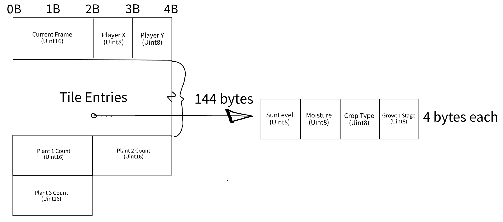

Collaborative Version : 
https://docs.google.com/document/d/1U30FLGgXsUcconFvlvZ_Tiv2GbogxrHIc-Jqn5xpH_Q/edit?usp=sharing

Asset Credit: [Sprout Lands - Asset Pack by Cup Nooble](https://cupnooble.itch.io/sprout-lands-asset-pack)

# Devlog Entry #1 - 11/17/2024

## Introducing the Team
* Carolyn Hope - Design Lead
* Ian Stentz - Tools Lead
* Lorraine Torres - Engine Lead
* Chase Croy-Perrett - Assistant Design Lead

## Tools and Materials
* We will be using Phaser as a 2D framework primarily because all our engineers have past experience with Phaser. Phaser’s modular structure would allow team members to focus on different aspects of the game (physics, graphics, or input handling) while maintaining smooth collaboration. Phaser 3 and its libraries also offer many built-in-tools for asset management, physics, and rendering, enabling quick prototyping and iteration. Phaser also provides extensive documentation to facilitate resource finding and troubleshooting, allowing our team to implement an efficient game.
* We will be using Javascript with Phaser and JSON, as this will allow rapid development and deployment of the 2D web-based game we’re aiming to make for this project. Javascript and Phaser are tools all of us are familiar with, which will allow us to spend less time grappling with the engine and more time implementing features and ensuring the organization and memory-efficiency of our codebase. Finally, we hope to use JSON as a tool to manage different kinds of game objects and quickly add new ones to the project.  
* We expect to use Visual Studio Code for code authoring throughout the project, and since Phaser allows the importing of 2D assets with extreme ease, we will use Paint.net - which Carolyn feels skilled in and will lead the rest of us on - for the creation of visual assets. If necessary, we will also be using Tiled if our game ends up needing a tiled world (it probably will be - given the theme), and it is both an easy tool to use and a familiar one, thanks to 120.
* Our platform switch will be from javascript to typescript. We feel like this is a meaningful change because though we are keeping Phaser, which will help greatly with displaying images, typescript will require us to restructure our code - unlike, for example, how a change from typescript to javascript might go. We chose typescript because it is familiar to all of us, and the platform switch options with other common game engines like Unity seemed to go too obscure.

## Outlook
While other teams may focus on a simple farming simulator, we intend to focus on the act of creating new crops by cross-pollination. We anticipate that the most challenging part of the project will be to implement consistent formatting between code and clear documentation. We hope to learn how to implement the various design patterns and learn what development in Javascript looks like from beginning-to-end.

# Devlog Entry #2 - 11/29/2024 - F0

## How we satisfied the software requirements
For our assignment, we represent the game as a 6x6 grid of tiles in top-down view. There is a character represented currently by a basic sprite that can navigate the grid by using “WASD” or the arrow keys, which will cause them to move one tile in the corresponding direction. Players advance time manually one frame at a time by either moving to another tile or pressing “Space.” The player can use “1/2/3” to select the corresponding seed packet (no visual feedback for this yet), and then can use left click on either the cell the player is occupying or one of the adjacent cells in order to plant the crop. As time progresses (as previously described), the plants will grow. They both require a certain amount of moisture and a certain amount of sunlight, varying by plant, and will individually grow given those conditions are fulfilled. The player can left click a fully grown crop in order to harvest it. Once the player has harvested at least one of each plant type, the game ends and displays “You won” to the screen.

## Reflection
Our initial plan was to use the Phaser library however as we began working through the initial requirements we opted for the p5.js library because its built-in functions gave us a simple and flexible way to build a 2D grid-based game without the need for complex tilemap rendering. While our project has the required gameplay of player movement, planting crops, harvesting, and simulating environmental changes, it doesn't need the features of a full-fledged game engine like Phaser. Instead, we chose to meet the requirements with p5.js for its flexibility in drawing graphics and handling basic interactivity. We may utilize Phaser’s features in the future for UI feedback and scene management. We also added Live Server to our list of developmental tools so we could launch our web page (index.html) in the browser and automatically see the changes we made before committing to the main branch.

# Devlog Entry #3 - 12/7/2024 - F1

## How we satisfied the software requirements
Since F0, we have converted the project from using a sketch.js based approach - drawing everything manually each frame through a call to the draw function - to a more phaser-based approach. We are now using Phaser's scene system to define a load scene which initializes our assets, a main menu scene, and a game scene which can be cycled between. Now instead of calling draw() each frame for each scene, we add sprite and text objects to the scene and let it handle drawing those individually each frame. 
* F0.a: Now the player is represented by an object inheriting from sprite that moves by calling a move method which changes the sprite's x and y values. Saving and loading the player's state does not create a new sprite, instead simply moving the sprite. This means the sprite gets created once and only once per session, at the beginning of the session
* F0.b: Same as last week
* F0.c: Crops are also their own sprite objects. Similar to the player, they are pooled by being created once and only once, and are made visible and invisible as necessary, their texture and growth data being overwritten whenever a new crop is planted on that tile.
* F0.d: Same as last week, except the text display is created once and updated with event handlers on a cell-by-cell basis
* F0.e: Same as last week
* F0.f: Same as last week, except now a newly planted crop is planted before sun water and growth are updated that frame, potentially growing it immediately.
* F0.g: Same as last week

* F1.a: We are representing the Array in AoS structure, holding a header with basic singleton data like player location and the current frame, and then a list of structures representing the data of both ground conditions and plant conditions for each cell in individual structures, and then placed inventory after the end, using Uint16 in the case that a maniac decides to farm more than 255 of each crop. We did this so that we could iterate through the array entry-by-entry and update each one at a time by grabbing a chunk of data just once. All the data that is state-dependent is now stored in/references the byte array, which includes everything related to the board state like player location and the crop on each cell but nothing related to specific sprite objects, text objects, or anything else that will always be created at the beginning of the scene.
 
* F1.b: The player has the option to save to a slot by pressing O and entering a number into the prompt 1-6, and can load at any time by pressing P and entering 1-6. The game is saved via storing the board state into a base64 string and storing that state in the local storage of the browser in a location corresponding to the save file. Loading is done first by decoding that string into the byte array, and then refreshing all sprites and texts with the data loaded from the board. Since all data is now stored to the board or decoded from it, that is all that is necessary. They can also delete files at any time by pressing L
* F1.c: The game gets saved to a dedicated auto save slot in the same way as regular saves, overwriting the save at the end of each tick(), which happens after any board-altering action is done (moving, planting, waiting, harvesting - if the action was valid) and after the tick is calculated (sunlight, water, growth)
* F1.d: The player is able to press U to undo each change and I to redo each change recently undone. By undoing and committing any action other than redoing, the redo memory is cleared. Undoing is stored by encoding each Array buffer representing previous board states into base64 strings, which makes it easy to save by simply storing a single concatenated string (including the current state) to local storage. It is loaded by slicing that string apart, storing those strings to the stack, and decoding the most recent string to the current state board. Redoing also gets saved in the same way, in a seperate place in local storage so that it is easy to tell the two apart.

## Reflection
As mentioned in the previous section, we decided to move from a frame-by-frame system to a phaser scene-based approach, which looks more like the average game engine. In addition, we have again postponed the hybridization, as we figured it wouldn't rock the boat with how F1 gets implemented but would be annoying to do half-way through. Additionally, looking ahead to F2, it seems like the perfect time to implement it, as it does make the unique growth requirements that are in the requirements for the internal DSL. We have mostly stuck to the choices for the roles, although for the most part the roles have broken down as it's all hands on deck for engineering, whoever can get what done. 

Addendum 12/7/2024: it is possible we thought we were using phaser when we were using p5 the whole time :/ whoops. But since this was done refactoring between F1 and F2, perhaps we can use this for the alternate platform

# Devlog Entry #4 - 12/8/2024 - F2

## How we satisfied the software requirements

### F0+F1
No major changes made.

### External DSL for Scenario Design
```
[monoculture]
start_moisture = 10
seeds_in_play = ["brambleberry","wheat","gilderberry"]
win_conditions = [
    ["brambleberry","harvest",1],
    ["wheat","harvest",1],
    ["gilderberry","harvest",1]
]
weather_conditions = [["sunny"],["storm",30,50]]
```
For our DSL we are using TOML to design it, and then translating it to JSON in order for easier integration into the project with phaser. We picked TOML because it was quick and easy to use. This block means that the intial board state has each tile start with 10 moisture in it, that the plants in play both in terms of what the player can plant and what can be hybridized is limited to "brambleberry" "wheat" and "gilderberry" and that the win conditions are to harvest 1 of each. The weather conditions for this scenario are "sunny" which has no scheduled start and end frame and thus lasts the whole session, meaning tiles will be on average sunnier, and "storm" from frames (30,50) inclusive, which will blot out the sun providing much less sunlight but provide much more moisture while it passes through.

### Internal DSL for Plants and Growth Conditions

### Switch to Alternate platform

We incidentally already did this, at the end of F1. We moved the visual interface from p5 to phaser. Much of the implementation code changed, but due to a large reliance on helper functions and specifically board.js, it was easier than expected. The main issue was the move from the draw() for text and sprites to objects, which was amended using sprite subclasses and event dispatchers. Our original plan was to move to typescript, which we did also try to do more recently, but due to the team's unfamiliarity with setting up the environment on our own, we spent hours gaining only headaches and opted to spend our time elsewhere.

## Reflection

* Our team was originally planning to switch to typescript, but due to some internal difficulties around time management and lack of experience, we were not able to figure out how to set up the environment for typescript without sacrificing time that would be easier spent doing the rest of the assignment. Therefore, even though it would have helped during our F2 and F3 requirements to be able to make use of interfaces, typechecking, and the like, we will leave the only the switch p5-> phaser as our alternate platform switch. 
* We have not particularly rethought the roles, as we are not really abiding by them anyways. Our workflow tool knowledge is limited, thus our tools lead (the one writing this) is not able to fulfill his role, nor is anyone also able to. 
* Our code is now a lot more focused on the main menu rather than just the game scene, as a lot of important things regarding loading choices now take place there (load autosave, select scenario on new save).

# Devlog Entry #5 - 12/8/2024 - F3

## How we satisfied the requirements

### F0+F1+F2
No major changes.

### Internationalization
Our game was internationalized using localization.json which contains the string translations that will be shown to the player. When starting the game players can select their language in LanguageSelectionScene and their choice is saved to phasers registry so it can be accessed by the other scenes. To add a message, just edit the json file. To add a new language, we add a new key and it translated strings to localization.json, then add a button to the LanguageSelectionScene so players can select it. Farm.js can then get the current language from the registry and parses the json file to apply the translated strings where they are needed, like in the inventory display and in the prompts.

### Localization
Our game supports english, spanish, arabic (Right-to-left), and chinese (locographic). Since we did not know arabic or chinese we used Google Translate to translate the strings. To properly handle arabic and chinese in Farm.js, we used a helper function to adjust the alignment of arabic text and changed the font family of the chinese text. Players can select their language at the start of play on a dedicated language selection scene and their language is applied from then on.

### Mobile Installation
To make the mobile app play offline, we simply followed the tutorial at https://developer.mozilla.org/en-US/docs/Web/Progressive_web_apps/Guides/Making_PWAs_installable & https://developer.mozilla.org/en-US/docs/Web/Progressive_web_apps/Tutorials/js13kGames/Installable_PWAs that was listed in the F3 requirement. All we had to do was add the webmanifest and include it in the HTML, and then it's available to add to home screen from the webpage with an icon.

### Mobile Play (Offline)
https://developer.mozilla.org/en-US/docs/Web/Progressive_web_apps/Tutorials/js13kGames/Offline_Service_workers https://github.com/madskristensen/WebEssentials.AspNetCore.ServiceWorker/issues/66 https://stackoverflow.com/questions/49157622/service-worker-typeerror-when-opening-chrome-extension were used to help. We used the Service Workers, as instructed by the PWA tutorial. We did need to use some additional resources to get the sw.js working, but once it was fully understood, it was rather straightforward.

## Reflection
Throughout the project we chose a minimal design to focus on meeting the requirements, meaning we did not have a lot of textual feedback. This made internationalization and localization easier to implement because there wasn't a lot to changes to be made or many strings to translate. We also made use of many resources to accomplish these requirements. Due to the disconnect of this assignment from the game itself, and how late it is in the project no real rethinks have been made to the plans or design since F2.